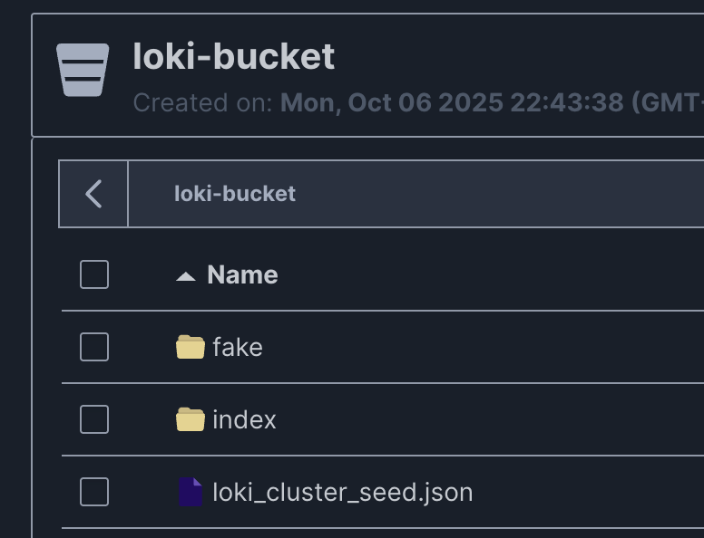

# Система мониторинга логов Grafana стек
Cистема мониторинга логов с использованием Docker, Grafana, Loki, Alertmanager, Promtail, MinIO и PostgreSQL.

## Основные сервисы
- **Grafana** - веб-интерфейс для визуализации логов и алертов
- **Loki** - агрегация, индексация и хранение логов
- **Promtail** - агент для сбора логов из файлов
- **Alertmanager** - маршрутизация и отправка алертов
- **MinIO** - объектное хранилище для данных Loki
- **PostgreSQL** - реляционная БД для хранения алертов

## Как работает система

### Архитектура системы


### Как приложение работает

1. **Генерация логов**: Приложение `logs-app` генерирует логи разных уровней (DEBUG, INFO, WARNING, ERROR, CRITICAL)


2. **Сбор логов**: `Promtail` автоматически собирает логи из файла и отправляет их в `Loki`

3. **Индексация и хранение**: `Loki` индексирует логи по меткам (уровень, сервис) и сохраняет в `MinIO`


4. **Мониторинг**: `Loki` проверяет правила алертинга на наличие критических логов

5. **Алертинг**: При обнаружении CRITICAL лога:
   - `Alertmanager` **немедленно** отправляет уведомление в **Telegram**
   
   - `Alertmanager` отправляет webhook в `alert-api`
   - `alert-api` сохраняет алерт в `PostgreSQL`
   

6. **Визуализация**: `Grafana` отображает логи на дашборде


### Настройка Telegram алертинга

Для получения уведомлений в Telegram необходимо настроить бота:

1. **Создайте Telegram бота:**
   - Напишите @BotFather в Telegram
   - Отправьте команду `/newbot`
   - Следуйте инструкциям и получите токен

2. **Получите chat_id:**
   - Напишите вашему боту любое сообщение
   - Откройте: `https://api.telegram.org/bot<YOUR_BOT_TOKEN>/getUpdates`
   - Найдите `"chat":{"id": ЧИСЛО}`

3. **Настройте конфигурацию:**
   - Отредактируйте `data/alertmanager/alertmanager-config.yml`
   - Замените `bot_token` и `chat_id`

### 1. Подготовка окружения
```bash
git clone https://github.com/dmastrih/monitoring_system_grafana.git
cd log_monitoring_system

# Генерация кредов для системы
python generate_env.py
```

### 2. Запуск системы
```bash
docker-compose up -d
docker-compose ps
```